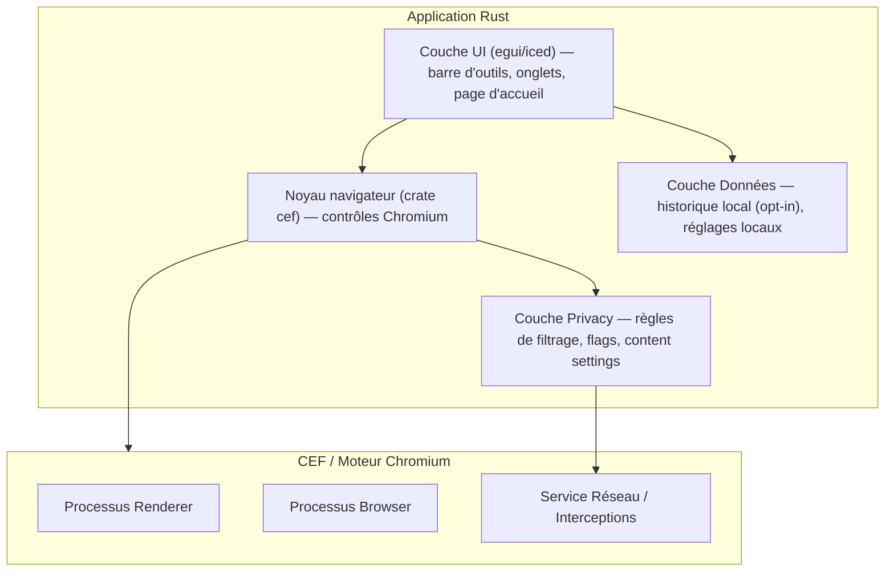

# 🛡️ Faraday — Plan de Développement

> **Navigateur web basé sur Chromium embarqué, tous les trackings désactivés par défaut.**
> Cible : **Windows 10 minimum** (et Windows 11) · Public : **grand public**

---

## 1. Vision & Objectifs

**Faraday** est un navigateur « privacy-first » conçu pour être utilisé par tout le monde, sans aucune configuration technique. Son slogan : *« La protection est le réglage par défaut. »*

### Objectifs produit
- 🔒 **Aucun tracking par défaut** : cookies tiers bloqués, pas d'empreinte numérique, pas de télémesure.
- 🚀 **Simple** : une interface épurée, aucune option obscure.
- ⚡ **Rapide** : basé sur Chromium, héritant de ses performances.
- 🧭 **Indépendant** : moteur de recherche par défaut respectueux de la vie privée (DuckDuckGo / Startpage), pas de services Google.

### Non-objectifs (pour l'instant)
- Pas de synchronisation cloud de comptes.
- Pas de gestion de profils multi-utilisateurs avancée (phase 2).
- Pas d'extensions (à évaluer en phase ultérieure).

---

## 2. Décisions techniques

### 2.1 Base de développement : **Rust + CEF (`cef-rs`)**

| Critère | Choix | Justification |
|---|---|---|
| Moteur | **CEF (Chromium Embedded Framework)** | Chromium « nu », contrôle total des flags de privacy et interceptions réseau. |
| Bindings Rust | **crate `cef` (`cef-rs`)** | Maintien actif par l'équipe **Tauri** (v152 ≈ Chromium 152), 100 % de l'API CEF. |
| UI | **`egui`** ou **`iced`** (fenêtres via `tao`/`winit`) | UI native Windows 10/11, moderne et légère, écrite en Rust. |
| Langage | **Rust** | Performance, sûreté mémoire, binaire léger (aucun runtime externe). |
| Cible | **Windows 10 (1809+) / Windows 11** | x64 (et ARM64 en option). |

### 2.2 Alternatives (si besoin de réévaluer)
- **CefSharp + .NET/WPF** : UI Windows à maturité plus longue, mais runtime .NET et langage C#.
- **WebView2 (`wry`/Tauri)** : plus simple, mais dépend du **runtime Microsoft Edge** (moins « Chromium pur », moins de contrôle des flags).
- **CEF en C++ pur** : contrôle ultime, mais développement bien plus lent.

> **Recommandation** : partir sur **Rust + `cef-rs`**. C'est le choix qui garantit un **Chromium pur**, un contrôle total de la confidentialité et **aucune dépendance externe** (ni .NET, ni runtime Edge de Microsoft).

### 2.3 Architecture applicative


---

## 3. Configuration Privacy « zéro tracking » (cœur du projet)

C'est la partie **critique** du produit. Tout doit être désactivé/restreint par défaut.

### 3.1 Flags Chromium via ligne de commande (CEF `CommandLine`)
```
--disable-component-update
--disable-default-apps
--disable-sync
--disable-suggestions
--disable-features=Preload,PrefetchPrivacyChanges,NetworkService
--host-resolver-rules=MAP * ~NOTFOUND (si embargo DNS donné, sinon retirer)
```
> En Rust : ces flags sont passés via `cef::CommandLine` au moment de l'initialisation du `CefApp`/`CefSettings`.

### 3.2 Content Settings (blocage par défaut)
Cookie/stockage tiers : `Block`
Cookies : bloquer les cookies tiers `BlockThirdParty`
Géolocalisation : `Block`
Caméra & micro : `Block` (sauf action explicite)
Notifications (push) : `Block`
Emplacement : `Block`
Battery status : `Block`
WebUSB / WebBluetooth : `Block`
Pas de stockage persistant : `Session Only`

### 3.3 Interception réseau & blocage trackers (CEF `RequestHandler`)
- Implémenter le `RequestHandler` (via `cef::RequestHandler`) pour **bloquer les requêtes** vers des domaines de trackers/pubs connus (filtre par liste type EasyList + listes anti-trackers).
- Empêcher le **prefetch / preconnect / DNS prefetch**.
- Forcer le **Do-Not-Track** (`X-DNT: 1`).

### 3.4 WebRTC & empreinte numérique
- Désactiver WebRTC ou forcer masquage IP : `--webrtc-ip-handling-policy=disable_non_proxied_udp`
- Désactiver le fingerprinting audio/video.
- Désactiver l'« autoplay » non sollicité.
- Désactiver le partage de connexion aux sites tiers.

### 3.5 Vie privée navigateur
- **Historique** : ne pas enregistrer par défaut (ou effacer en sortie).
- **Autofill / mots de passe** : désactivés par défaut.
- **Cookies** : « session uniquement » + vidés à la fermeture.
- **HTTPS-only** : forcer le passage en HTTPS quand disponible.
- **Moteur de recherche par défaut** : DuckDuckGo (ou Startpage), jamais Google.

### 3.6 Pages d'accueil / nouvelles fenêtres
- Page d'accueil locale « Faraday » (aucune requête réseau fantôme, aucun contenu sponsorisé).
- Aucun « nouveau onglet » alimenté par un service tiers.

---

## 4. Phasage du développement

### 📅 Phase 0 — Fondations (sem. 1–2)
- Créer le dépôt Git, initialiser le projet **Rust** (`cargo init`, workspace Cargo).
- Ajouter le crate **`cef`** et configurer le `CefSettings` + `CommandLine`.
- Définir les constantes de flags & le fichier de config `PrivacyConfig.toml`.
- Point de contrôle ✔ : une fenêtre `egui`/`iced` affiche une page web Chromium.

### 📅 Phase 1 — Coquille du navigateur (sem. 2–5)
- Barre d'adresse, boutons préc./suiv./actualiser/accueil.
- **Gestion multi-onglets** (plusieurs `WebView` CEF dans des fenêtres `tao`).
- Navigation, gestion des téléchargements, page d'erreur.
- Point de contrôle ✔ : navigation fluide multi-onglets.

### 📅 Phase 2 — Moteur Privacy (sem. 5–9) ⭐ cœur du produit
- Implémenter le `RequestHandler` (blocage trackers/pubs).
- Appliquer **tous** les Content Settings « blocage par défaut ».
- Implémenter les flags Chromium + fichier de config.
- Activer HTTPS-only, Do-Not-Track, effacement à la fermeture.
- Point de contrôle ✔ : test avec des sites de tracking connus → **0 tracker détecté**.

### 📅 Phase 3 — Expérience utilisateur (sem. 9–12)
- Page d'accueil Faraday moderne et épurée.
- Paramètres minimalistes (onglet « Confidentialité » en avant-plan).
- Signal visuel « protection active » (bouclier).
- Point de contrôle ✔ : non-techniciens savent se servir du navigateur.

### 📅 Phase 4 — Qualité & sécurité (sem. 12–15)
- Tests unitaires (flags, filtres réseau, content settings).
- Tests E2E + tests manuels de privacy (panels de trackers, navigateur « fingerprint »).
- Audit de sécurité, gestion des mises à jour CEF.
- Point de contrôle ✔ : aucune régression de performance, privacy validée.

### 📅 Phase 5 — Distribution (sem. 15–17)
- Packaging **MSI / EXE** (WiX ou Inno Setup), **signature de code**.
- Installateur Windows 10/11 (x64, éventuellement ARM64).
- Auto-update signée, page de téléchargement, documentation utilisateur.
- Point de contrôle ✔ : installation propre sur Windows 10 propre (VM).

---

## 5. Stack technique récapitulative

| Domaine | Technologie |
|---|---|
| Moteur | CEF via crate `cef` (Chromium 152) |
| Langage / build | Rust (`cargo`, workspace) |
| UI | `egui` (ou `iced`) + `tao`/`winit` |
| Base de données locale | `rusqlite` (SQLite chiffré) pour les réglages |
| Blocage trackers | Liste de règles intégrée (EasyList + anti-track) |
| Moteur de recherche par défaut | DuckDuckGo |
| Packaging | WiX / Inno Setup + signature |
| CI/CD | GitHub Actions (`cargo build`, tests, packaging) |

---

## 6. Critères de réussite (définition de « done »)

- ✅ Sur un site de tests de tracking (ex. `cover your tracks` de l'EFF), Faraday obtient une protection quasi-totale **par défaut**.
- ✅ Aucune requête vers des services Google/tiers au démarrage.
- ✅ Cookies tiers et empreinte numérique bloqués sans intervention de l'utilisateur.
- ✅ Fonctionne de façon fluide sur **Windows 10 (1809+)** et Windows 11.
- ✅ Tous les réglages de vie privée sont accessibles en **≤ 2 clics**.

---

## 7. Risques & points d'attention

- **Mise à jour de CEF** : sécurité critique → pipeline d'auto-update obligatoire.
- **Site cassés** : désactiver trop de choses peut casser certains sites (PayPal, banques). Prévoir un mode « déblocage ponctuel » clair.
- **Complexité WI-FI/entreprises** : gérer les proxys et certificats d'entreprise.
- **Poids de l'app** : CEF ~ 150–200 Mo ; prévoir un installateur et un temps de démarrage optimisés.

---

*© Faraday — document de planification v2.0 (option Rust)*
